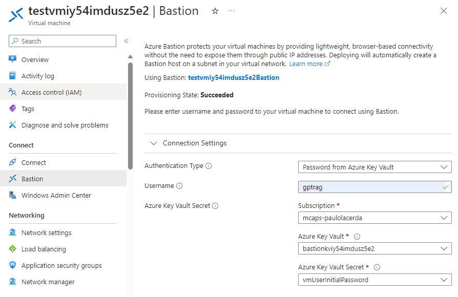

# Multi-Environment Azure DevOps Setup - Orchestrator

This document outlines the steps to set up a multi-environment workflow to deploy the orchestrator service to Azure using Azure Pipelines, taking the solution from proof of concept to production-ready.

> [!IMPORTANT]
>
> - To follow this guide, the infrastructure creation step must already be completed using the guidance in the [GPT-RAG](https://github.com/Azure/GPT-RAG) repository. This repository does not cover infrastructure creation, but rather the deployment of a service to the infrastructure.
>
> - This guide additionally assumes that Service Principals have been created for each environment using the guidance in the [GPT-RAG](https://github.com/Azure/GPT-RAG) repository.

# Decisions required:

- Service Principals that will be used for each environment
- Decisions on which Azure DevOps Repo, Azure subscription, and Azure location to use

# Prerequisites:

- An Azure DevOps Organization and Project are already set up.
- [Azure CLI](https://learn.microsoft.com/en-us/cli/azure/install-azure-cli-windows?tabs=azure-cli) with [Azure DevOps extension](https://learn.microsoft.com/en-us/azure/devops/cli/?view=azure-devops)
- [Azure Developer CLI](https://learn.microsoft.com/en-us/azure/developer/azure-developer-cli/install-azd?tabs=winget-windows%2Cbrew-mac%2Cscript-linux&pivots=os-windows)
- [PowerShell 7](https://learn.microsoft.com/en-us/powershell/scripting/install/installing-powershell?view=powershell-7.4)
- [Git](https://git-scm.com/downloads)
- Azure DevOps organization
- Bash shell (e.g., Git Bash)
- Personnel with the following access levels:
  - In Azure: Either Owner role or Contributor + User Access Administrator roles within the Azure subscription, which provides the ability to create and assign roles to a Service Principal
  - In Azure DevOps: Ability create and manage [Service Connections](https://learn.microsoft.com/en-us/azure/devops/pipelines/library/service-endpoints?view=azure-devops), contribute to repository, create and manage pipelines, and Administrator access on [Default agent pool](https://learn.microsoft.com/en-us/azure/devops/pipelines/policies/permissions?view=azure-devops#set-agent-pool-security-in-azure-pipelines)

# Steps:

> [!NOTE]
> All commands below are to be run in Bash.

## 1. Set up environment

### Setup

`cd` to the root of the repo. Before creating environments, you need to define the environment names. **These are the same environment names that were used when setting up the infrastructure in the [GPT-RAG](https://github.com/Azure/GPT-RAG) repository.**

> [!NOTE]
> When setting up the service connections in the [GPT-RAG](https://github.com/Azure/GPT-RAG) guide, the service connection name is the same as the environment name. Note that this variable is used to represent the service connection name later in this guide.

```bash
dev_env='<dev-env-name>' # Example: dev
test_env='<test-env-name>' # Example: test
prod_env='<prod-env-name>' # Example: prod
```

Next, define the names of the Service Principals that will be used for each environment. You will need the name in later steps. **These are the same Service Principal names that were used when setting up the infrastructure in the [GPT-RAG](https://github.com/Azure/GPT-RAG) repository - the per-environment service principals are reused here.** In this collection of guides, the per-environment service principals are used for the infrastructure and services.

```bash
dev_principal_name='<dev-sp-name>'
test_principal_name='<test-sp-name>'
prod_principal_name='<prod-sp-name>'
```

Authenticate with `az`:

```
az login
```

Then, set some additional variables that will be used when setting up the environments, pipelines, and credentials.

> [!NOTE]
> The `rg_location` variable needs to be the location of the resource group where the infrastructure was created with the [GPT-RAG](https://github.com/Azure/GPT-RAG) repository. The `subscription_id` should be set to the subscription ID where the infrastructure is deployed; the command below will return the subscription you logged into with `az login`.

```bash
org='<your-org-name>'
project='<your-project-name>'
repo='<your-repo-name>'
subscription_id=$(az account show --query "id" --output tsv)
rg_location='<your-resource group-location>'
tenant_id=$(az account show --query "tenantId" --output tsv)
pipeline_name="Azure Dev Deploy ($repo)"
```

Get the service principal IDs for each environment:

```bash
dev_service_principal_id=$(az ad sp list --display-name $dev_principal_name --query "[0].appId" --output tsv)
test_service_principal_id=$(az ad sp list --display-name $test_principal_name --query "[0].appId" --output tsv)
prod_service_principal_id=$(az ad sp list --display-name $prod_principal_name --query "[0].appId" --output tsv)
```

Then, get a personal access token (PAT) from Azure DevOps and set the AZURE_DEVOPS_EXT_PAT environment variable. [This guide](https://learn.microsoft.com/en-us/azure/devops/organizations/accounts/use-personal-access-tokens-to-authenticate?view=azure-devops&tabs=Windows#create-a-pat) describes how to create a PAT. Ensure the PAT has:

- "Read & execute" Build permissions.
- "Source code, repositories, pull requests, and notifications" and "Full" Code permissions.
- "Read and manage environment" Environment permissions.
- "Use and manage" Pipeline Resources permissions.
- "Read, query, and manage" Service connections permissions.

```
export AZURE_DEVOPS_EXT_PAT=<your-pat>
```

> [!CAUTION]
> Do _not_ check your PAT into source control.

Configure the default Azure DevOps organization and project:

```bash
az devops configure --defaults organization=https://dev.azure.com/$org project=$project
```

## 2. Create Pipeline

Create the Azure DevOps pipeline using the Az CLI:

> [!NOTE]
>
> - The `--name` and `--description` can be changed to any value you prefer.
> - Choose to configure the pipeline to run on a specific branch by changing the `--branch` parameter.

```bash
az pipelines create --name "$pipeline_name" --description "Pipeline for project: $repo" --repository $repo --branch '<your-branch>' --repository-type tfsgit --yml-path .azdo/pipelines/azure-dev.yml --skip-first-run true

```

### Variable setup

Set up the variables for the pipeline that will deploy the service. `AZURE_LOCATION`, `AZURE_SERVICE_CONNECTION`, `AZURE_SUBSCRIPTION_ID`, and `AZURE_TENANT_ID` are required for the pipeline to run.

```bash
pipeline_id=$(az pipelines show --name "$pipeline_name" --query "id")

az pipelines variable create --name 'AZURE_LOCATION' --value $rg_location --pipeline-id $pipeline_id
az pipelines variable create --name 'AZURE_SUBSCRIPTION_ID' --value $subscription_id --pipeline-id $pipeline_id
az pipelines variable create --name 'AZURE_TENANT_ID' --value $tenant_id --pipeline-id $pipeline_id
```

Finally, set up a variable for the environment-specific service principals:

```bash
az pipelines variable create --name 'AZURE_SERVICE_PRINCIPAL_ID_DEV' --value $dev_service_principal_id --pipeline-id $pipeline_id
az pipelines variable create --name 'AZURE_SERVICE_PRINCIPAL_ID_TEST' --value $test_service_principal_id --pipeline-id $pipeline_id
az pipelines variable create --name 'AZURE_SERVICE_PRINCIPAL_ID_PROD' --value $prod_service_principal_id --pipeline-id $pipeline_id
```

## 3. Install `azd` Azure DevOps Task for deploying with Microsoft-hosted agent (if applicable)

If you did not provision network isolated infrastructure with the [GPT-RAG](https://github.com/Azure/GPT-RAG) repository, you need to install the `azd` Azure DevOps task to deploy the services using the Microsoft-hosted agent. Get it free from the [Azure DevOps Marketplace](https://marketplace.visualstudio.com/items?itemName=ms-azuretools.azd). You only need to do this in your organization once.

## 4. Set up self-hosted agent for deploying to network isolated infrastructure (if applicable)

If you opted to provision network isolated infrastructure with the [GPT-RAG](https://github.com/Azure/GPT-RAG) repository, you will need to set up a self-hosted agent to deploy the services.

> [!IMPORTANT]
>
> - When you opt to deploy network isolated infrastructure with [GPT-RAG](https://github.com/Azure/GPT-RAG), a virtual machine is created in the network isolated environment. This guide uses this virtual machine as the self-hosted agent for deploying services, since the VM is already integrated into the virtual network and the majority of tooling for building the services are already installed on it. While self-hosted agents can be set up in other ways - e.g., with Docker - this guide does not cover other setup approaches.
> - This guide assumes the self-hosted agent will be reused by all of the services (i.e., by multiple repositories).

### Setting up the VM as a self-hosted agent

1. Log into the virtual machine with the user **gptrag** and authenticate with the password stored in the Key Vault, similar to the figure below:
   

> [!TIP]
> If you get Error "You do not have access to List secrets for this resource", you need to be added as a Key Vault Secrets User in the Key Vault that starts with `bastionkv`.

2. Upon login to Windows, install the remaining build tools:

   - Install the Azure Developer CLI on the agent by following the instructions from [here](https://learn.microsoft.com/en-us/azure/developer/azure-developer-cli/install-azd?tabs=winget-windows%2Cbrew-mac%2Cscript-linux&pivots=os-windows).
   - Install [Powershell](https://learn.microsoft.com/en-us/powershell/scripting/install/installing-powershell-on-windows?view=powershell-7.4#installing-the-msi-package) and **ensure that Powershell is added to the PATH**.
   - To verify the installation of the tools, ensure you can run the `pwsh` and `azd` commands in a new PowerShell terminal.

3. Follow the instructions in the [Azure DevOps documentation](https://learn.microsoft.com/en-us/azure/devops/pipelines/agents/windows-agent?view=azure-devops#download-and-configure-the-agent) install the self-hosted agent tooling on the VM.

## 5. Modify the workflow files as needed for deployment

> [!IMPORTANT]
>
> - The environment names are defined as variables within the below described `azure-dev.yml` file, **which need to be edited to match the environment names you created.** In this example, the environment name is also used as the service connection name. If you used different names for the environment name and service connection name, you will **also need to update the service connection parameter passed in each stage**.
> - The `trigger` in the `azure-dev.yml` file is set to `none` to prevent the pipeline from running automatically. You can change this to `main` or `master` to trigger the pipeline on a push to the main branch.
> - If deploying a non-network isolated solution, uncomment the `setup-azd@0` `Install azd` task in the `deploy-template.yml` file, and comment out the `PowerShell@2` `Install azd` task.
> - If deploying a network isolated solution, uncomment the `PowerShell@2` `Install azd` task in the `deploy-template.yml` file, and comment out the `setup-azd@0` `Install azd` task.

- The following files in the `.azdo/pipelines` folder are used to deploy the service to Azure:
  - `azure-dev.yml`
    - This is the main file that triggers the deployment workflow. The environment names are passed as inputs to the deploy job.
  - `deploy-template.yml`
    - This is a template file invoked by `azure-dev.yml` that is used to deploy the service to Azure.

### Updating agent configuration (if using a self-hosted agent)

- If you are using a self-hosted agent, you will need to update the YAML configuration. The value [set in the `pool`](https://learn.microsoft.com/en-us/azure/devops/pipelines/yaml-schema/pool?view=azure-pipelines#examples-1) field in the `.azdo/pipelines/azure-dev.yml` file is the pool that the agent was created in. This can be found in the Agent pools settings in the Azure DevOps organization or project.

## Next steps

If you haven't deployed the [Frontend](https://github.com/Azure/gpt-rag-frontend) or [Ingestion](https://github.com/Azure/gpt-rag-ingestion) services, deploy these next.
